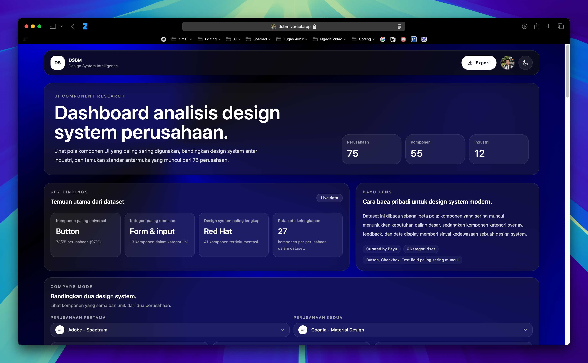

# DSBM - Design System Intelligence

DSBM adalah dashboard riset untuk melihat pola komponen UI dari design system perusahaan besar. Project ini ditujukan untuk designer, frontend engineer, dan peneliti produk yang ingin membandingkan komponen, industri, dan kecenderungan antarmuka dari banyak perusahaan dalam satu tempat.

Project ini membantu menjawab pertanyaan seperti: komponen apa yang paling umum dipakai, design system mana yang bisa dibandingkan, dan bagaimana pola UI berbeda antar industri.

## Latar Belakang

Banyak design system perusahaan tersedia secara publik, tetapi informasinya tersebar di banyak situs dan sulit dibandingkan secara cepat. Akibatnya, proses riset komponen sering dilakukan manual: membuka dokumentasi satu per satu, mencatat komponen, lalu mencari pola yang berulang.

DSBM menawarkan solusi berupa dashboard eksplorasi data. Data perusahaan, design system, industri, dan daftar komponen dikumpulkan ke dalam satu antarmuka sehingga pengguna bisa mencari, memfilter, membandingkan, dan mengekspor hasil riset dengan lebih efisien.

## Fitur Utama

- Menjelajahi database design system dari 75 perusahaan.
- Mencari perusahaan berdasarkan nama, design system, industri, atau komponen.
- Memfilter komponen berdasarkan kategori agar riset lebih fokus.
- Melihat ringkasan frekuensi komponen yang paling sering digunakan.
- Membandingkan dua perusahaan untuk menemukan komponen yang sama dan berbeda.
- Menggunakan dark mode dengan preferensi yang tersimpan di browser.
- Mengekspor dataset ke format CSV untuk analisis lanjutan.

## Demo

Live demo belum tersedia. Setelah project dideploy, tambahkan tautannya di bagian ini.

```text
Demo: Belum tersedia
Repository: https://github.com/m4sbay/dsbm
```

Screenshot dashboard:



## Tech Stack

| Teknologi | Alasan Penggunaan |
| --- | --- |
| HTML5 | Struktur aplikasi sederhana, cepat dibuka, dan mudah dideploy sebagai static site. |
| JavaScript | Mengelola data, filter, pencarian, perbandingan, export CSV, modal, dan interaksi UI tanpa framework tambahan. |
| Tailwind CSS | Mempercepat styling utility-first dan menjaga konsistensi responsive design. |
| Tailwind CLI | Build CSS ringan tanpa konfigurasi bundler yang kompleks. |
| Vercel | Cocok untuk deploy static site dengan build command sederhana. |

## Struktur Project

```text
.
├── index.html          # Struktur halaman utama dan markup UI
├── script.js           # Data, state, rendering, interaksi, dan export CSV
├── input.css           # Source CSS Tailwind dan custom component styles
├── output.css          # CSS hasil build yang dipakai browser
├── tailwind.config.js  # Konfigurasi Tailwind
├── package.json        # Script npm dan dependency
├── vercel.json         # Konfigurasi deployment Vercel
└── README.md           # Dokumentasi project
```

## Menjalankan Secara Lokal

### Prasyarat

- Node.js 14 atau lebih baru
- npm

### Instalasi

```bash
git clone https://github.com/m4sbay/dsbm.git
cd dsbm
npm install
```

### Build CSS

```bash
npm run build
```

### Development Mode

Jalankan Tailwind dalam mode watch agar perubahan di `input.css`, `index.html`, dan `script.js` otomatis dikompilasi ke `output.css`.

```bash
npm run build-css
```

### Menjalankan Server Lokal

Project ini adalah static site. Setelah CSS dibuild, kamu bisa membuka `index.html` langsung di browser atau menjalankan server lokal sederhana:

```bash
python3 -m http.server 4173
```

Lalu buka:

```text
http://127.0.0.1:4173
```

## Cara Menggunakan Aplikasi

1. Buka dashboard DSBM.
2. Gunakan kolom pencarian untuk menemukan perusahaan, design system, atau komponen tertentu.
3. Gunakan filter industri dan kategori komponen untuk mempersempit data.
4. Buka mode perbandingan untuk memilih dua perusahaan dan melihat overlap komponen.
5. Gunakan tombol export untuk mengunduh dataset dalam format CSV.
6. Aktifkan dark mode jika ingin tampilan gelap.

## Konfigurasi dan Keamanan

Project ini tidak membutuhkan environment variable untuk berjalan secara lokal. Semua data saat ini berada di `script.js`.

Jika di masa depan project memakai API, database, atau layanan pihak ketiga:

- Jangan commit secret key, token, atau credential ke repository.
- Simpan secret di environment variable lokal atau dashboard provider deployment.
- Tambahkan file `.env` ke `.gitignore` jika mulai menggunakan konfigurasi lokal.
- Gunakan `.env.example` untuk mendokumentasikan nama variable tanpa nilai rahasia.

## Roadmap

- Menambahkan screenshot dan live demo resmi.
- Memindahkan dataset ke file JSON terpisah agar lebih mudah dirawat.
- Menambahkan metadata sumber dan tanggal update untuk setiap design system.
- Menambahkan visualisasi chart untuk tren komponen.
- Menambahkan fitur import data baru dari format CSV atau JSON.
- Menambahkan test ringan untuk fungsi filter, compare, dan export.

## Deployment

Project sudah memiliki konfigurasi `vercel.json`.

```json
{
  "version": 2,
  "buildCommand": "npm run build",
  "outputDirectory": "."
}
```

Langkah deploy ke Vercel:

1. Push repository ke GitHub.
2. Import repository di Vercel.
3. Pastikan build command memakai `npm run build`.
4. Deploy project.

## Publikasi Checklist

- Nama dan deskripsi project sudah jelas.
- Problem dan solusi sudah dijelaskan.
- Fitur utama sudah dapat dipindai.
- Tech stack dilengkapi alasan pemilihan.
- Instruksi instalasi dan menjalankan lokal tersedia.
- Demo atau screenshot ditambahkan.
- Informasi keamanan, roadmap, lisensi, dan kontak tersedia.

## Lisensi

Project ini menggunakan lisensi ISC sesuai konfigurasi di `package.json`.

## Credits

- Data design system dikurasi dari dokumentasi publik berbagai perusahaan.
- Styling dibangun dengan Tailwind CSS.
- Project dibuat dan dirawat oleh Maulana Bayu.

## Kontak

- GitHub: [@m4sbay](https://github.com/m4sbay)
- LinkedIn: [Maulana Bayu](https://www.linkedin.com/in/mmaulanabayu/)
- Instagram: [@m4sbay](https://www.instagram.com/m4sbay/)
